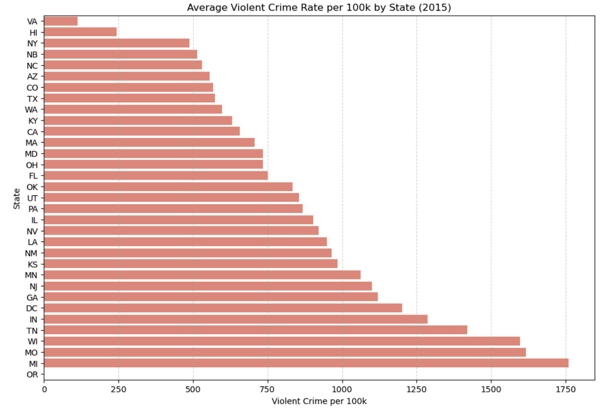
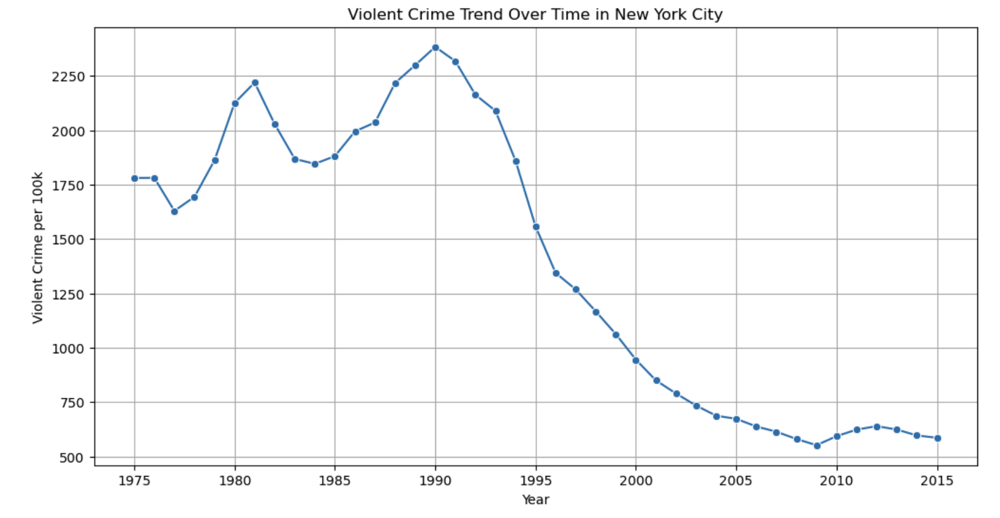

# Section 1: Motivation and Purpose
Our role: Data scientists working in the USA immigration department
Target Audience: Individuals looking to move to the United States 

Moving to a different country presents a whole boat load of new challenges. Often times there's language barriers, different cultures and a whole new way of life that can make it difficult for new comers to adapt to. Another key factor that new immigrants may consider when moving to a new country, like the United States for example, is safety. Like in every country there are cities/states that are considered more dangerous and some areas that are relatively safer. Knowing which areas have less crime can play a huge role in deciding where new immigrants would like to move to, espescially if they have young kids. This information is often not readily avalabile and easily accessible for the average indiidual so we as data scientists working at the USA immigration department aim to develop a dashboard containing important information regarding crime rates all throughout the United States. 

# Section 2: Description of the Data
The dataset we will be working with contains 2830 rows. Each row/example describes a city in the United States that contains around 15 relevant characteristics that shows different metrics for how much crime is being commited in that respective city. The relevance of these variables are adressed below: 

    - City and Administrative info:
        - ORI – Unique identifier for the reporting police department
        - department_name – Name of the city or police department
        - year – Year the data was reported
        - months_reported – Number of months the department reported data that year
        - total_pop – Total population of the city

    - Crime Counts (Totals)
        - homs_sum – Total number of homicides
        - rape_sum – Total number of rapes
        - rob_sum – Total number of robberies
        - agg_ass_sum – Total number of aggravated assaults
        - violent_crime – Total violent crimes (sum of the above categories)
    
    - Crime Rates (Per 100,000 residents)
        - violent_per_100k
        - homs_per_100k
        - rape_per_100k
        - rob_per_100k
        - agg_ass_per_100k

Using these variables we can derive numerous different kpi's and stats. For example in our dashboard we might incorporate a crime category ranking (using the Crime Counts labels) or ranking cities based off safety classification labels. 

# Section 3: Research Questions & Usage Scenarios

### Persona and Usage Scenario

Alex and Alexandra, are a young couple from South Africa looking to start a family. They grew up as farmers, but due to the recent political climate, general unrest, and high crime rates, they want to leave for a safer life. They have decided on moving to the United States, following president Trump’s announcements that South African farmers may be eligible to apply for refugee status. However, they recognize that various parts of the U.S. are no safer than South Africa. As they plan for children, they want to settle in the safest neighborhood or area possible. To support this decision, they are looking for a quick and accessible way to visualize crime rates across cities and compare different types of crime across locations.

When Alex and Alexandra log onto the “Crime Statistics US app,” they will see a map of the United States of America with bubbles over cities present in the data frame, the size of which will represent the relative crime rates. With this map, Alex and Alexandra can clearly compare relative crime rates between cities. They are also able to filter for specific states, crime reports, years, and zoom into specific states. If they click on a city, they can even view the crime rate trends over time for each of the different crime statistics available. 

Based on their use of the map, Alex and Alexandra have decided that the most crime happens in major cities and want to move somewhere more rural where they can start a farm. They decide on rural Kansas as a safe, remote area away from the city where they can live in peace and raise their children.

### User Stories

1. Alex and Alexandra have limited geographical knowledge of the U.S. and want to compare crime rates across different cities alongside their locations on a map. This will allow them to incorporate geographic context as an additional factor when deciding where they would like to live.
2. Alex and Alexandra want to filter for cities within specific states so they can compare crime rates with state laws, taxes, and lifestyles to ensure their choice of location offers a  suitable living environment as well.
3. As a couple looking to start a family, they want to compare cities on different kinds of crime, and compare different kinds of crime within cities in order to make an informed decision about where to live and raise their family.
4. Alex and Alexandra want to be able to search for specific locations in the US in order to decide if these cities fit their criteria for a place to live with regards to crime.
5. Alex and Alexandra want to look at trends of crime over time within cities to understand if crime rates are increasing or decreasing, as that will impact their decision on where to live.

# Section 4: Exploratory Data Analysis 

The first visualization compares the average violent crime rate per 100,000 residents across U.S. states using the most recent year of data (2015) from The Marshall Project’s crime dataset. Presenting the states side‑by‑side allows users like Alex and Alexandra to quickly identify which regions tend to have higher or lower levels of violent crime. This supports their need to narrow down potential destinations before exploring specific cities in more detail.

The second visualization focuses on New York City and shows how violent crime rates have changed over time. Examining long‑term trends helps users understand whether crime in a particular location is improving, worsening, or remaining stable. This is especially important for families planning a long‑term move, as it provides insight into the future safety of the area rather than relying on a single year of data.

Together, these visualizations demonstrate that the dataset used in our project can support geographic comparisons, filtering by location, and trend analysis, which are key components of the Crime Statistics US dashboard described in our project repository.

# Section 5: App Sketch & Description 

The USA Crime Dashboard is a single-page interactive app designed to allow users to explore historical crime patterns across the US. The interface is organized into a filter panel on the left and a main visualization area, allowing users to refine their selections while immediately observing updates across all components of the dashboard.

The filter section is grouped into different key sections. The **Date Range** filter allows users to analyze crime data across a desired time period. The **Geography** filters enable exploration by state, city and population. **Crime Details** filters allow users to look at specific crime categories and toggle between metric types. All filters apply globally and apply to all visualizations and summaries values.

The visualization area contained various views. An interactive map displays patterns where users can hover for a tooltip and click on states/cities to filter the dashboard. A stacked area chart shows how crime levels have changed over time and each category can be clicked to filter the dashboard. A ranking bar chart highlights the top x locations with highest crime rates based on the filters. A comprehensive data table is also provided with sortable values for users who wish to inspect the data further.

Key summary metrics are also displayed at the top to provide high level context for users.